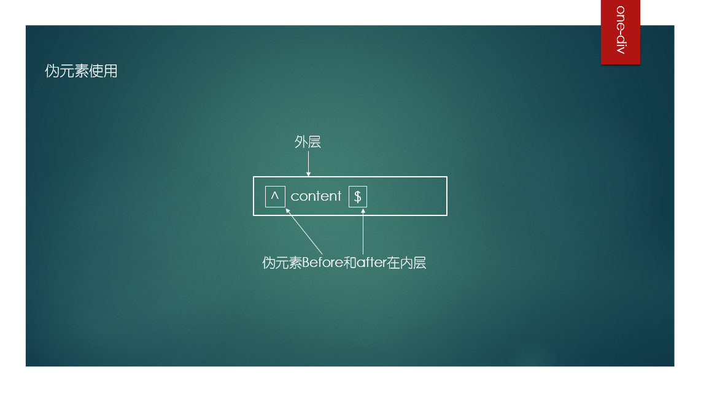
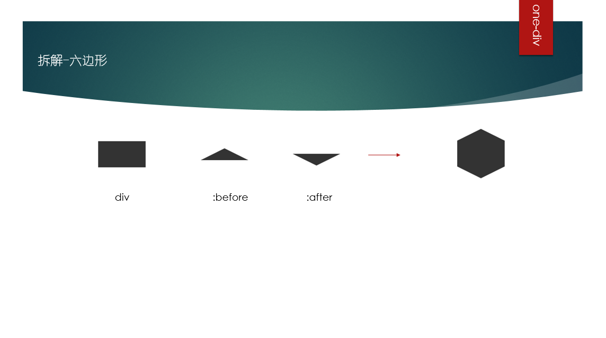
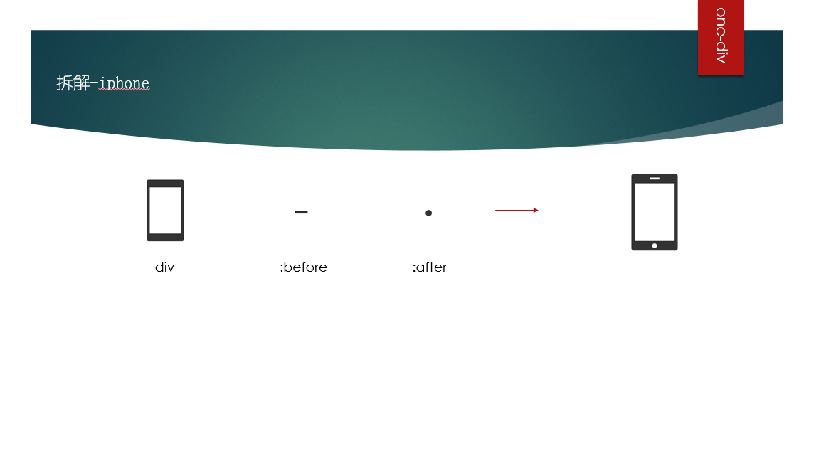

#one-div

### What is one-div？

基于CSS3的特性实现只用一个DIV绘制不规则图形

### What can one-div do？

- [codepen-demos](http://codepen.io/Nexthy/)
- [singlediv](http://a.singlediv.com/)
- [基于单个 Div 的 CSS 绘图](http://zhuanlan.zhihu.com/FrontendMagazine/19854868)
- [纯CSS画的基本图形](http://www.cnblogs.com/top5/archive/2012/02/14/2351959.html)
- [One DIV：纯 CSS 和一个 DIV 标签创建的图标合集](http://blog.wpjam.com/m/one-div/)
- [cssshapes](http://cssshapes.com/)
- [species-in-pieces](http://species-in-pieces.com/)
- [one-div](http://one-div.com/)

### How to create one-div？

我们需要了解一下CSS3的部分特性

##### 浏览器支持

- **All browser**

##### 边框(border)

##### 伪元素(:before & :after)
顾名思义，它创建了一个虚假的元素，并插入到目标元素内容之前或之后
##### 浏览器支持

- **Chrome 2+**
- **Firefox 3.5+ (3.0 had partial support)**
- **Safari 1.3+**
- **Opera 9.2+**
- **IE8+ (with some minor bugs)**
- **All mobile browser**

##### 圆角(border-radius)
##### 浏览器支持
- **Chrome 4.0+**
- **Firefox 2.0+** 
- **Safari 3.1+**
- **Opera 10.5+**
- **IE9+ **
- **Ios browser(all)**
- **Android browser(2.1&2.3 with some minor bugs)**

##### 变换(transform)
##### 浏览器支持
-  **Chrome 4.0+**
- **Firefox 3.5+ **
- **Safari 6.0+**
- **Opera 15.0+**
- **IE9+ **
- **Ios browser 6.0+**
- **Android browser 2.1+**

##### 线性渐变(linear-gradient)
##### 浏览器支持
- **Chrome 10.0+**
- **Firefox 3.6+ **
- **Safari 5.1+**
- **Opera 15.0+**
- **IE10+ **
- **Ios browser 5.0+**
- **Android browser 4.0+**

##### 径向渐变(radial-gradient)
##### 浏览器支持
- **Chrome 10.0+**
- **Firefox 3.6+ **
- **Safari 5.1+**
- **Opera 15.0+**
- **IE10+ **
- **Ios browser 5.0+**
- **Android browser 4.0+**

##### 阴影(box-shadow)
##### 浏览器支持
- **Chrome 4.0+**
- **Firefox 4.0+ **
- **Safari 3.1+**
- **Opera 10.5+**
- **IE9+ **
- **Ios browser 3.2+**
- **Android browser 2.1+**

### 让我们组合这些特性去创造不同

### 渲染效率
**简单icon对比**
| 方式 |   渲染 |   绘制  |network |
| :-------- | --------:| :------: | :------: |
| One-div |   渲染: 0.339 ms |   绘制: 0.216 ms  |network : 无 |
| base64  |   渲染: 0.469 ms |   绘制: 0.322 ms  |network : 1ms |
| 网络请求 |   渲染: 0.310 ms |   绘制: 1.514 ms  |network : 158ms |

**CSS特性对比**
| 方式 |   渲染 |   绘制  |network |
| :-------- | --------:| :------: | :------: |
| 不使用渐变、阴影等复杂特性 |   渲染: 0.276 ms |   绘制: 0.147 ms  |network : 无 |
| 使用渐变、阴影等复杂特性   |   渲染: 0.350 ms |   绘制: 0.283 ms  |network : 无 |

